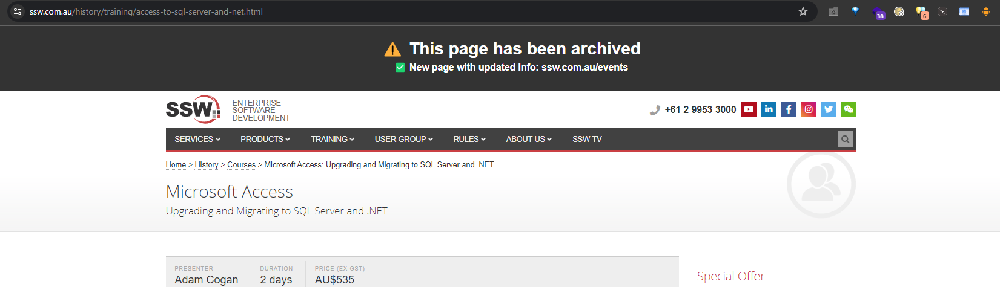

# SSW Website v1 Progress Tracking Repo

As per https://github.com/SSWConsulting/SSW.Website/issues/1263, we need a way to track the progress for which pages have been migrated to the v3 website.

This repository serves as a tracker of which pages have been migrated, we will zz each page that we have migrated to the v3 Next.js site.

We are not zzing pages on the original repo because we want those pages to stay live so we can compare the new pages with them.

v1 site - https://dev.azure.com/ssw2/ssw.website  
bypass frontdoor (to see old pages) - https://prod.ssw.com.au/

## Scripts

### Prerequisites

1. Python 3.x - [https://www.python.org/downloads/](https://www.python.org/downloads/)
2. Latest Chrome Driver - you can download it from here: [https://googlechromelabs.github.io/chrome-for-testing/#stable](https://googlechromelabs.github.io/chrome-for-testing/#stable)

### HTML Output Script

This script will save every page from the v1 website as HTML files in the `history` folder. It will scan each page and locate any images and save them in the `history` folder as well, preserving the original path of the images on the v1 site.

1. Open `html_archiver.py` file and go to the line of code of code below and make sure you point it to chrome driver (see prerequisites section above).
   ```python
   service = Service("C:\\selenium\\chromedriver.exe")
   ```
2. Install required modules
   ```bash
   pip install requests
   pip install selenium
   pip install bs4
   pip install html5lib
   ```
3. If using MacOS - go to the line of code below and make sure use forward slash `/` instead of `\\`

   ```python
   split_path = item_path.split("\\")
   ```

4. Run the Python script that generates the `history` folder, run the following command:

   ```bash
   python html_archiver.py
   ```

#### Features

> **Script + CSS Linking - `fix_scripts` and `fix_css`**

Modified existing core CSS and JS files exist in the `history` folder, and will be added to each page if required. Files include:

- `jquery.js` - JQuery
- `menu.js` - Megamenu script
- `moment.js` - Moment.js
- `ssw_pigeon.js` - the most important script to include, the entire JS bundle for most of the v1 sites
- `ssw_raven_print.css`
- `ssw_raven.css`
- All contents of the `css` directory (`Base.css`, `Content.css`, etc.) - only for archiving Standards

The script also removes all `iframe` and `script` tags to ensure we do not recieve unecessary noise + interaction (e.g. Chatbase, Google Analytics, etc.) when we are viewing these archived pages.

> **Image Downloading - `fix_images`**

By default, the script will download all images from every page it saves from the v1 site and save them in the `history` folder. It will save them in the same relative path as the original image on the v1 site e.g. `ssw.com.au/ssw/images/Raven/SSWLogo.svg` will save in `history/images/Raven/SSWLogo.svg`.

> **Image Replacement - `fix_images`**

By updating the `IMAGE_REPLACEMENTS` dictionary in the `html_archiver.py` file, you can replace any image on the v1 site with another image. The key (e.g. `adam_thumb.jpg`) will replace any image URL that ends with the key (e.g. `https://www.ssw.com.au/ssw/Standards/Images/adam_thumb.jpg`) with a non-broken image (e.g. `https://www.ssw.com.au/ssw/Events/Training/Images/adam_thumb.jpg`) and then save that image instead of the broken original image.

> **Link Replacement - `fix_links`**

This function replaces broken links, and links already archived (i.e. have `za` as the file prefix in the `SSW.Website.WebUI` folder).

> **Banner Addition - `add_archive_header`**

This function adds a banner to the top of the page to indicate that the page has been archived.



**Figure: The banner added to each page**

> **Index Page Creation - `output_index_page`**

This function generates a table of the pages that have been archived, and the links to the old pages.


**Figure: Index page example for `/Training`**

### Markdown Todo List

To run the Python script that generates the `todos.md` file, run the following command:

```bash
python todo_outputter_md.py
```

This will find and list all the aspx files in the project with associated directories, and tick off pages that have zz or za at the start.

### CSV Todo List

To run the Python script that generates the `todos.csv` file, run the following command:

```bash
python todo_outputter_csv.py
```

This will output a file called `todos.csv` that can be exported to Excel if required. The status of a page is determined by the prefix of the page name (more detail on prefixes below).

### Blob Storage Upload Script

All migrated files in your branch will automatically be pushed to blob storage when your PR is merged with main. Alternatively you can push the files to blob storage by triggering the workflow manually [here](https://github.com/SSWConsulting/SSW.Website-v1-Progress/actions/runs/8611464520).

<!-- Hi Harry, let me new instructions are decent
To run the shell script that uploads the `history` folder to Azure Blob Storage, run the following command:

Windows:

```shell
set ARCHIVE_KEY={{ KEY_HERE }}
upload_blob.cmd
```

Bash (Linux/Mac):

```bash
ARCHIVE_KEY={{ KEY_HERE }}
./upload_blob.sh
```
-->
## Tasks

- [ ] Turn off the v1 website's server
- [ ] Remove this repo once all pages have been migrated to v3

## Prefix Meaning

- zz - migrated to v3 or contains no content
- zr - redirects to another page
- za - migrated to archive

## CSV Headings

- `Page` - URL of the page
- `Status` - Either Done, Archived, Redirect or To-do
- `Priority` - value in powers of 2 e.g. 1, 2, 4, etc. - higher no. = higher priority
- `Complexity` - value in powers of 2 e.g. 1, 2, 4, etc. - higher no. = higher complexity
- `Notes` - additional info if required
